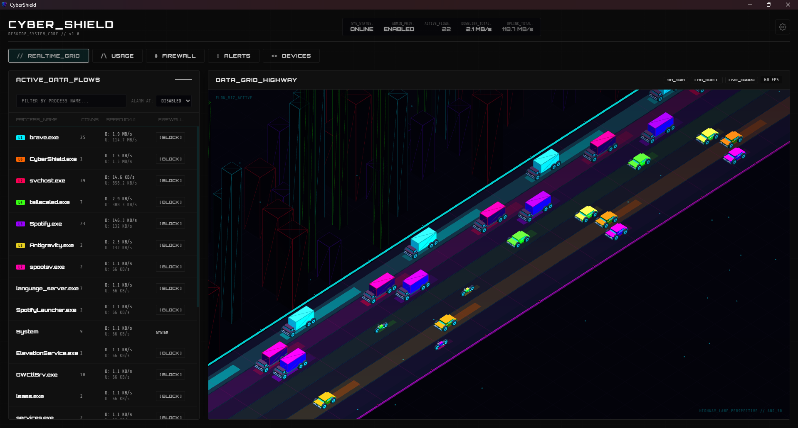

## CyberShield v1.0

  

CyberShield is a Windows desktop application that provides real-time network telemetry and interactive process-level firewall controls, packaged in a cyberpunk-themed interface. It utilizes a PyWebView and Flask backend paired with a frontend driven by HTML5, CSS, and JavaScript.

---

### Core Functionality

* **Realtime Grid**: Displays active data flows by process name, connections, and speed, alongside an isometric 3D visualization representing network traffic as vehicles on a highway (`Screenshot 2026-07-05 165004.jpg`).
* **Usage Tracking**: Breaks down total bandwidth consumption into categorized traffic logs, filtering data by application, host IP, and protocol/port type (`Screenshot 2026-07-05 165008.jpg`).
* **Firewall Management**: Lists blocked applications and executable paths, serving as a frontend controller to manage Windows Defender Firewall rules directly (`Screenshot 2026-07-05 165012.jpg`).
* **Alerts Stream**: Audits and displays chronological logs of newly established network connections and first-time remote host communication sequences by process (`Screenshot 2026-07-05 165016.jpg`).
* **Device Scanner**: Scans the local subnet (`LAN_MAP`) to discover active nodes, mapping out device status, name, local IP address, MAC address, and node type (`Screenshot 2026-07-05 165023.png`).

---

### Tech Stack & System Integration

* **Backend**: Python, Flask, SQLite3.
* **Frontend**: HTML5, CSS3, JavaScript (Three.js for 3D graphics, Chart.js for data visualization).
* **System Hooks**: Leverages `psutil` and native Windows utilities to monitor processes, alter firewall configurations, and handle system tray operations.
